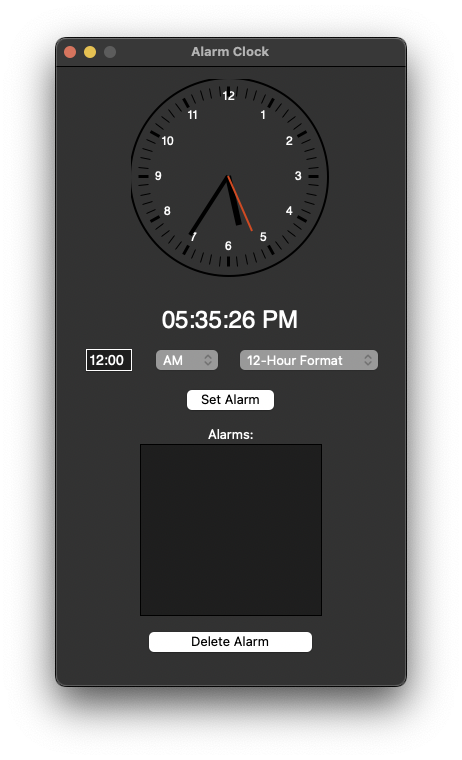

# Simple Python Alarm Clock

This is a simple alarm clock written in Python. It uses the Tkinter library for the GUI, Pygame for the alarm sound, and the Time library for the time.

## Table of Contents

- [Simple Python Alarm Clock](#simple-python-alarm-clock)
  - [Screenshots](#screenshots)
  - [Installation](#installation)
  - [Credits](#credits)
  - [Author](#author)

## Screenshots



## Installation

```bash
git clone https://github.com/mantreshkhurana/simple-python-alarm-clock.git
pip install virtualenv
python -m venv venv
source venv/bin/activate 
pip install -r requirements.txt
python app.py
```

or

```bash
git clone https://github.com/mantreshkhurana/simple-python-alarm-clock.git
pip3 install virtualenv
python3 -m venv venv
source venv/bin/activate
pip3 install -r requirements.txt
python3 app.py
```

## Credits

- [Analog Clock](https://thinkinfi.com/build-digital-analog-clock-gui-with-python-tkinter/)

## Author

- [Mantresh Khurana](https://github.com/mantreshkhurana)
